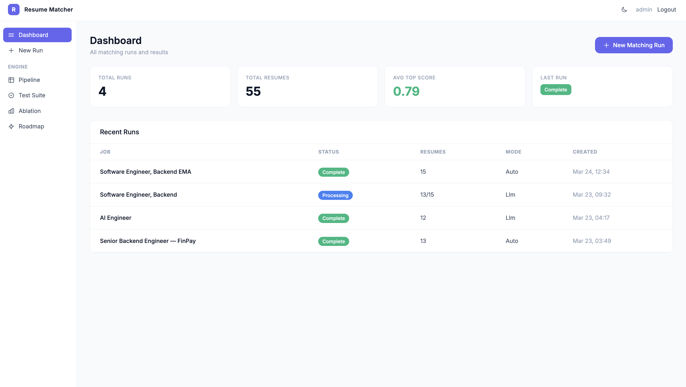
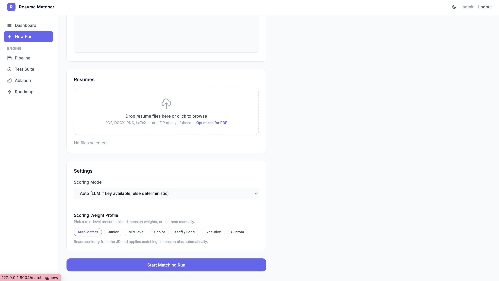
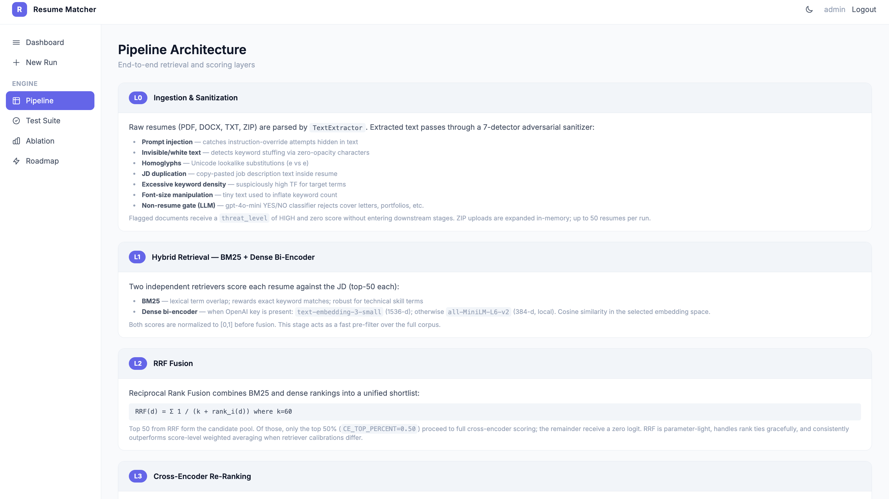
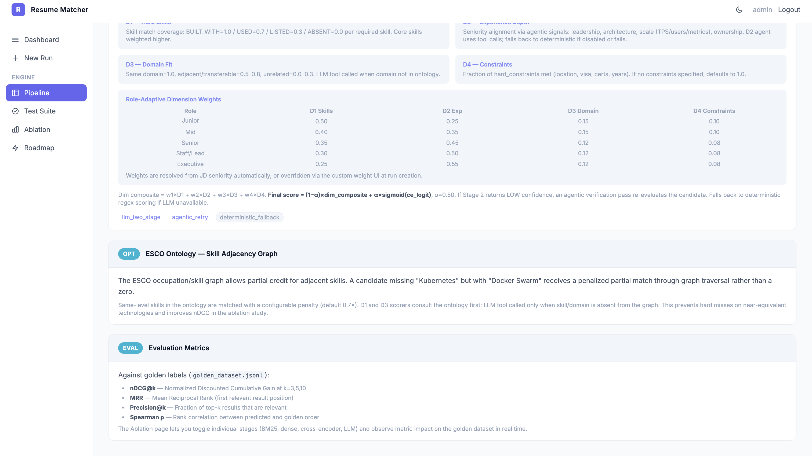
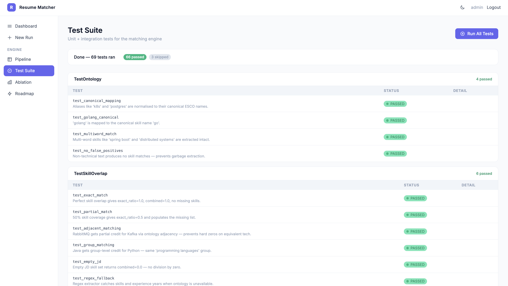
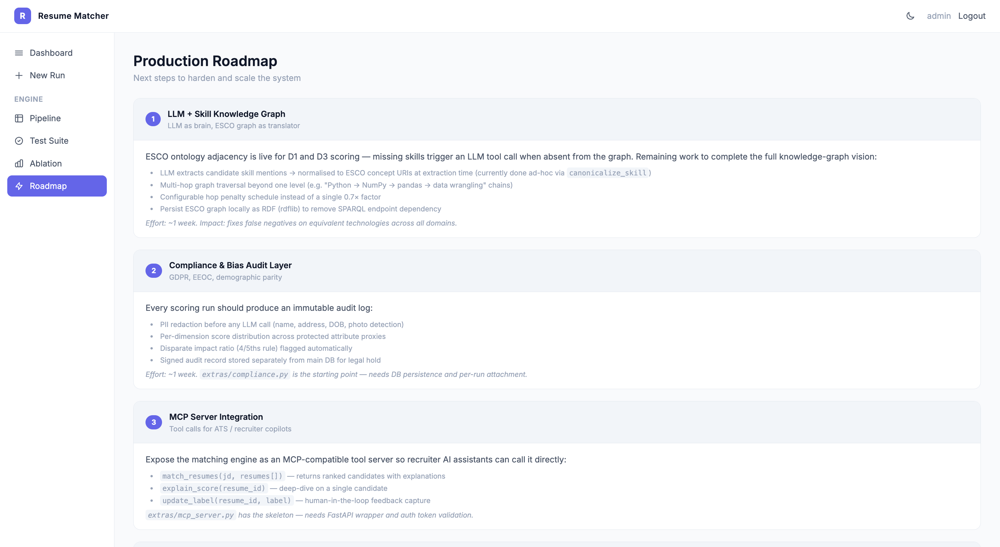
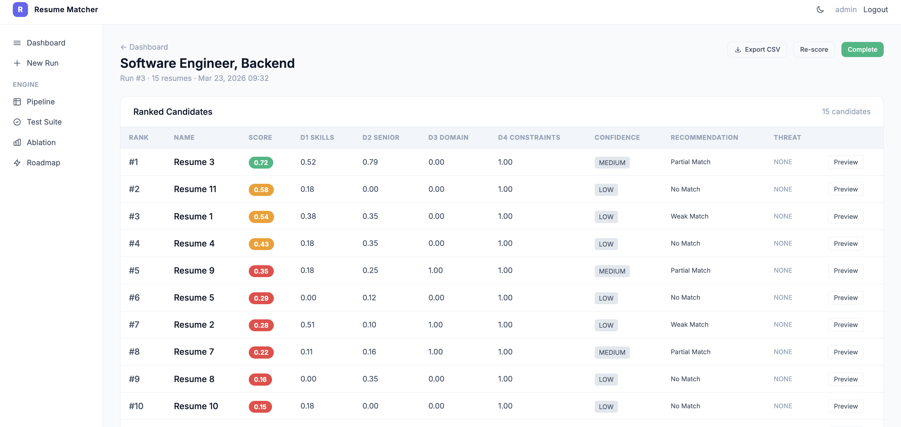
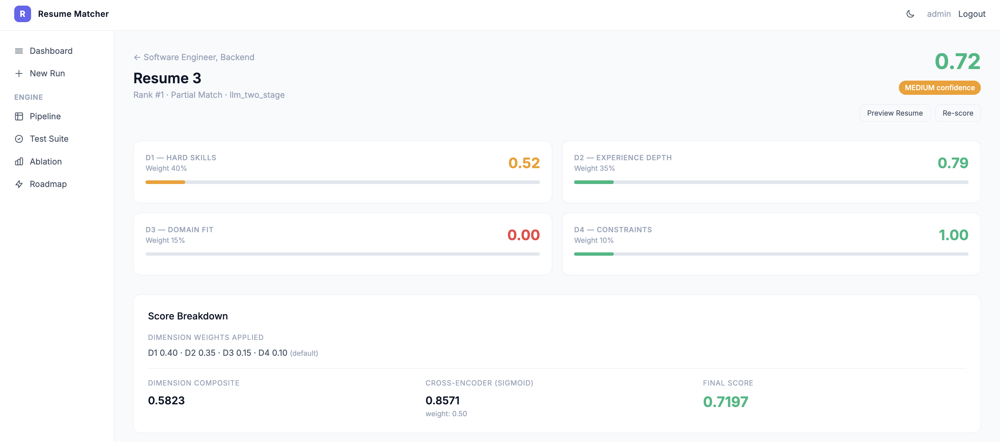

# RankForge

## Table of Contents

1. [Overview](#overview)
2. [Technical Approach & Justification](#technical-approach--justification)
3. [Architecture](#architecture)
4. [Setup & Usage](#setup--usage) — [Web UI walkthrough & screenshots](#web-ui-walkthrough--rankforge-screenshots)
5. [Testing](#testing)
6. [Project Structure](#project-structure)
7. [**Extended reference** →](docs/reference.md) benchmarks, roadmap, limitations, research, citations

---

## Overview

### Background

Resume–JD matching sits at the intersection of **information retrieval**, **structured scoring**, and **governance**. Legacy hiring stacks often combine **keyword-first** ATS filters with opaque rankers. That pairing creates well-studied failure modes: **synonym blindness** (the same capability expressed in different words scores as a miss) and **false negatives at scale**—Harvard Business School & Accenture’s *Hidden Workers: Untapped Talent* (2021) estimates on the order of **27 million** workers in the United States are marginalized by how automated filters and rigid screening interact with qualified candidates who do not match narrow keyword templates. Stakeholders also resist **black-box** rankings when scores cannot be tied to **evidence** in the source documents. Regulators are moving in parallel: the **EU AI Act** classifies AI intended for **recruitment and workforce decisions** as **high-risk** (Article 6 and Annex III), and **NYC Local Law 144** requires **independent bias audits** of covered automated employment decision tools, including **impact ratio** analysis consistent with the EEOC **four-fifths** rule. RankForge is an open codebase aimed at **explainable** matching: **dimensions, evidence, and tests**—not a single unexplained scalar.

**Citations (background):** [1] Joseph B. Fuller et al., *Hidden Workers: Untapped Talent*, Harvard Business School & Accenture (2021). [2] Regulation (EU) 2024/1689 (AI Act), Art. 6 & Annex III (employment / workers management). [3] NYC Admin. Code §20-870 *et seq.* (Local Law 144 on automated employment decision tools). Full bibliography: [References](docs/reference.md#references).

### Problem

**Volume** overwhelms manual review; **automation without structure** drifts toward brittle or un-auditable judgments. Candidates and tools are also locked in an **arms race**: keyword stuffing, hidden text, and prompt-style manipulation degrade signal if ingestion is naive. The core problem this repo tackles is: **rank resumes against a JD with explicit, inspectable reasons** (skills, seniority, domain, constraints) combined with retrieval relevance—so a reviewer can see **why** a row sits where it does, and the stack can be **evaluated** like software, not only demo’d.

### Issues

Several tensions drive the design:

- **Lexical vs semantic** — Boolean-style matching misses paraphrases; embedding-only shortcuts can miss must-have tokens. RankForge uses **BM25 + dense bi-encoder + RRF + cross-encoder** so exact terms and meaning are both represented.
- **Integrity of the document** — prompt injection, invisible text, JD duplication, keyword stuffing, and non-resume files need **sanitization and penalties** before scores are trusted.
- **Trust & oversight** — final outputs should pair **numbers with evidence** (skills, quotes, threat flags) so hiring teams are not asked to trust a lone opaque grade; roadmap hooks include fairness-style metrics (see [reference](docs/reference.md#future-steps--production-roadmap)).
- **Stability** — the same resume–JD pair should not swing wildly when evidence is unchanged; bounded LLM use and deterministic merges help.
- **Calibration** — fusion weights and hyperparameters should eventually be **fit to labeled data**, not only hand-tuned (see [Future Steps](docs/reference.md#future-steps--production-roadmap)).

### Solution

**RankForge** implements a **Python-first matching engine** plus a small Django web app for runs and tooling. Each candidate receives a **0–1** score built from **four interpretable dimensions (D1–D4)** blended with a **cross-encoder** signal, with **evidence** where the pipeline exposes it.

**Inputs:** job description + resumes (PDF, DOCX, image, LaTeX, plain text, ZIP).  
**Outputs:** ranked list with per-dimension breakdowns, strengths/gaps where available, confidence, and threat/sanitizer flags.

**Pipeline in short**

1. **Ingest & sanitize** — MIME-aware extraction (PDF, DOCX, images via OCR, LaTeX, HTML strip, etc.); **seven** adversarial detectors (prompt injection, invisible text, homoglyphs, JD duplication, keyword stuffing, experience inflation, credential overload); optional **non-resume gate** on a text prefix; penalties feed the final score multiplier.  
2. **Retrieve** — **BM25** and a **dense bi-encoder** run in parallel; ranked lists are fused with **RRF** (k=60) into one shortlist so both exact tokens and paraphrases influence who moves forward.  
3. **Re-rank** — **Cross-encoder** scores the **top fraction** of the RRF pool (configurable **`CE_TOP_PERCENT`** in `src/config.py`); the rest still get a **rank-derived** logit so every row has a relevance signal for the dim/CE blend without full pairwise CE on the whole set.  
4. **Score** — **D1–D4** on structured profiles: **D1** skills via **ontology tiers** (exact → adjacent → group) on top of evidence levels (BUILT_WITH / USED / LISTED); **D2** seniority via signals + agent/tools or deterministic fallback; **D3** domain via canonical labels and **`ADJACENT_DOMAINS`** before optional LLM fallback; **D4** hard-constraint checklist; where LLMs are on, the judge adds **narrative** (rationale, strengths/gaps) while published dimension numbers stay **grounded** in those layers.  
5. **Return** — ranked table, CSV export path, and **per-candidate** detail (dimensions, skill evidence rows, retrieval diagnostics, threat flags).

### Planned work

Calibration will require **joint estimation** of **dimension weights**, the **cross-encoder blend** (α), and **retrieval** hyperparameters on **golden** and **adversarial** corpora, together with **production hardening** (durable job queues, storage, rate limits, and compliance-oriented controls). A concise treatment appears under [Future Steps & Production Roadmap](docs/reference.md#future-steps--production-roadmap).

The **skills** and **domain** layers are intended to move from the present ESCO-style **alias and adjacency** representation toward a **graph** with **multi-hop relations** and **stronger normalization**, so that **D1** and **D3** remain traceable as coverage increases. **D4** should, where practical, use the **same conceptual schema** (e.g. licensure, clearance, and location as typed entities rather than unconstrained strings) so constraint evaluation stays aligned with skill and domain grounding. Background, optional tooling notes, and citations are in the [extended reference](docs/reference.md#research-alignment) and [References](docs/reference.md#references).

### Context (architecture & narrative)

For a **readable walkthrough** of the design (figures, layers, and rationale), see **[Architecture_Document.pdf](Architecture_Document.pdf)** in the repo root. The LaTeX source is [`docs/architecture.tex`](docs/architecture.tex) if you want to rebuild or cite sections. Screens from the web UI are under [`docs/rankforge_screens/`](docs/rankforge_screens/). **Deeper background** (labor-market and regulatory framing, adversarial hiring-tech notes, and slide narrative) lives alongside the code in **`docs/`** as research memos and presentation materials—use them if you need the full literature-style chain behind the abstractions above.

---

## Technical Approach & Justification

### Model Selection

| Component | Model | Purpose |
|-----------|-------|---------|
| **Stage 1 — Profile Extraction** | OpenAI `gpt-4o-mini` | Cheap structured extraction of JD and resume profiles |
| **Stage 2 — Scoring** | OpenAI `gpt-4o` | Few-shot 4D scoring with temp=0 for consistency |
| **Lexical Retrieval** | BM25 (`rank_bm25`) | Exact term overlap (Go, Kafka, PostgreSQL) |
| **Dense Retrieval** | `all-MiniLM-L6-v2` or `text-embedding-3-small` | Semantic similarity (“payment APIs” ≈ “financial microservices”) |
| **Re-ranking** | `cross-encoder/ms-marco-MiniLM-L-6-v2` | Joint [JD, resume] encoding for context-aware relevance |

### Why This Approach?

| Choice | Primary Advantage | Trade-off |
|--------|------------------|-----------|
| **Two-stage LLM** | Stage 1 (cheap) extracts structured profiles; Stage 2 (expensive) scores on a compact, deterministic schema. Caching profiles avoids re-extraction when resumes are unchanged. | Latency: ~1–2 LLM calls per resume; cost scales with candidate count |
| **Hybrid retrieval (BM25 + dense)** | BM25 catches exact keywords; dense catches paraphrases and synonyms. Together they cover both “Kafka” and “event streaming platforms”. | Two indices to maintain; RRF fusion adds minimal overhead |
| **RRF fusion (k=60)** | Parameter-free; no score calibration across retrievers; robust to scale differences between BM25 and cosine similarity | Fixed k may not be optimal for all corpus sizes |
| **Cross-encoder rerank** | Highest quality relevance signal for [JD, resume] pairs; catches inflated language (“used Python once” vs “led Python backend”) | Expensive: O(n) pairwise calls; applied only to top 50% of RRF pool |
| **4D + CE scoring** | Explainable: D1 (skills), D2 (seniority), D3 (domain), D4 (constraints) + CE blend. JD seniority presets + optional per-run custom weights; CE weight from config. | Hand-tuned defaults; **planned:** joint fit of dimension weights, CE α, and retrieval hyperparameters via regression on labeled data |
| **Ontology (curated skill graph + domain pairs)** | **Grounding in use today:** skills are matched in order **exact → adjacent → group**, with **lower tier multipliers** on top of evidence level (BUILT_WITH / USED / LISTED). Domains use **canonical labels** plus **`ADJACENT_DOMAINS`** before any LLM. | Off-graph cases use optional **LLM tool fallbacks** (`D1_LLM_FALLBACK`, `D3_LLM_FALLBACK` in `src/config.py`). |

**LLM vs deterministic (by dimension).** **D1 / D3** are **ontology-first**; an LLM tool runs **only** when exact / adjacent / (for D1) group coverage does not resolve the skill or domain. **D2** inverts that pattern when the agent is enabled: the **LLM orchestrates** calls into **deterministic** tool implementations on resume evidence, and **falls back** to fully deterministic seniority-from-profiles if the agent path fails. The scoring LLM still produces rationale and strengths/gaps; the **D1–D4 values that enter the final blend** are the **merged, grounded** profile scores (not unconstrained judge floats).

### Alternatives Considered

| Alternative | Why Not Chosen |
|-------------|----------------|
| **TF-IDF only** | In ablation, a 70K-char academic paper ranked #1 because it contained every keyword. No semantic understanding. |
| **Dense only** | Misses exact technical terms; “Go” and “Golang” may diverge in embedding space depending on context. |
| **LLM-only scoring (no structure)** | Unpredictable outputs; hard to audit; no traceability to evidence. Our D1–D4 are **grounded** in ontology/regex/agents where possible. |
| **Single LLM call for extraction + scoring** | More prompt drift; harder to cache; we separate cheap extraction (cached) from expensive scoring. |
| **Pure cross-encoder for all pairs** | O(n²) cost; infeasible for 100+ resumes. We use CE only on top candidates from RRF. |

---

## Architecture

### End-to-End Pipeline

```
Job Description  +  Resumes (PDF / DOCX / PNG / LaTeX / TXT / ZIP)
       │                      │
       │                      ▼
       │         ┌─────────────────────────────────────────────┐
       │         │  L0  INGESTION & ADVERSARIAL SANITIZATION   │
       │         │                                             │
       │         │  Text Extraction (MIME-first detection)     │
       │         │  ├─ PDF     → pypdf + pdftotext fallback    │
       │         │  ├─ DOCX    → pandoc + python-docx fallback │
       │         │  ├─ Image   → pytesseract OCR               │
       │         │  ├─ LaTeX   → plain text                    │
       │         │  └─ HTML    → BeautifulSoup strip tags      │
       │         │                                             │
       │         │  Adversarial Detectors (7 independent)     │
       │         │  ├─ Prompt injection   (strip + penalise)     │
       │         │  ├─ Invisible text     (zero-width chars)     │
       │         │  ├─ Homoglyph attack  (Cyrillic → Latin)     │
       │         │  ├─ JD duplication    (n-gram overlap)      │
       │         │  ├─ Keyword stuffing  (TF density ratio)     │
       │         │  ├─ Experience inflation (timeline gap)     │
       │         │  └─ Credential anomaly (>7 certs listed)     │
       │         │                                             │
       │         │  Non-Resume Gate (LLM: gpt-4o-mini)         │
       │         │  → YES/NO on first ~1200 chars              │
       │         │  → Score 0, threat=HIGH if NO               │
       │         │                                             │
       │         │  Content Dedup (SHA-256 hash)               │
       │         └─────────────────────────────────────────────┘
       │                      │ clean text + threat_report
       │                      ▼
       │         ┌─────────────────────────────────────────────┐
       │         │  STAGE 1  PROFILE EXTRACTION (gpt-4o-mini)  │
       ├────────►│                                             │
       │  JD     │  JD Profile: required_skills, years_required,│
       │         │  domain, seniority, hard_constraints         │
       │         │                                             │
       │         │  Resume Profile: skills (name, level,       │
       │         │  evidence), total_years, domains,           │
       │         │  seniority_signals, highlights              │
       │         │  level ∈ {BUILT_WITH, USED, LISTED, ABSENT} │
       │         └─────────────────────────────────────────────┘
       │                      │ jd_profile + resume_profile
       │                      ▼
       │         ┌─────────────────────────────────────────────┐
       │         │  L1  HYBRID RETRIEVAL                       │
       │         │  ├─ BM25  (rank_bm25, lexical)              │
       │         │  └─ Bi-encoder (all-MiniLM-L6-v2 or        │
       │         │     text-embedding-3-small)                 │
       │         └─────────────────────────────────────────────┘
       │                      │ two ranked lists
       │                      ▼
       │         ┌─────────────────────────────────────────────┐
       │         │  L2  RRF FUSION  (k=60)                    │
       │         │  score(d) = Σ 1/(60 + rank_i(d))           │
       │         └─────────────────────────────────────────────┘
       │                      │ unified ranking
       │                      ▼
       │         ┌─────────────────────────────────────────────┐
       │         │  L3  CROSS-ENCODER RE-RANKING               │
       │         │  ms-marco-MiniLM-L-6-v2                     │
       │         │  Top 50% through CE; rest get RRF-derived    │
       │         │  score; docs outside pool get ce_logit=-10  │
       │         └─────────────────────────────────────────────┘
       │                      │ ce_logit per resume
       │                      ▼
       │         ┌─────────────────────────────────────────────┐
       │         │  STAGE 2  PROFILE D1–D4 + JUDGE LLM       │
       │         │  Compute D1–D4 from profiles first       │
       │         │  (ontology tiers, D2 agent/tools, D4)     │
       │         │  Judge LLM: rationale / strengths / gaps    │
       │         │  Published D1–D4 = grounded merge (above)  │
       │         │  Agentic retry: if confidence=LOW → 1       │
       │         │  bounded re-score (verify_score)            │
       │         └─────────────────────────────────────────────┘
       │                      │
       │                      ▼
       │         ┌─────────────────────────────────────────────┐
       │         │  FINAL SCORE FORMULA                        │
       │         │  dim = w1·D1 + w2·D2 + w3·D3 + w4·D4       │
       │         │  (defaults 40/35/15/10 or role / custom %) │
       │         │  raw = 0.5·dim + 0.5·σ(ce_logit)           │
       │         │  (CE_WEIGHT in src/config.py, default 0.5) │
       │         │  final = raw · (1 − adversarial_penalty)   │
       │         └─────────────────────────────────────────────┘
       │                      │
       │                      ▼
               Ranked candidates with final_score, D1–D4,
               strengths, gaps, per-skill evidence, threat_level
```

### Scoring Dimensions

| Dimension | Weight | Description |
|-----------|--------|-------------|
| **D1 — Hard Skills** | 0.40 | Match JD required_skills to resume; BUILT_WITH=1.0, USED=0.7, LISTED=0.3, ABSENT=0.0 |
| **D2 — Experience Depth** | 0.35 | Leadership, Architecture, Scale, Ownership signals from seniority_signals + total_years |
| **D3 — Domain Fit** | 0.15 | Same domain=1.0, adjacent=0.5–0.8, unrelated=0.0–0.3 |
| **D4 — Hard Constraints** | 0.10 | Fraction of hard_constraints met (years, certs, location, etc.) |

### Retrieval Formulation: CE Top 50% + Rank-Wise Full Coverage

The cross-encoder is expensive (O(n) pairwise [JD, resume] calls). We apply it only to the **top CE_TOP_PERCENT** of the RRF pool (env, default 50% → top 25 of 50). **All other docs** receive a RRF rank-derived logit.

**RRF over all docs:** RRF fusion runs over the **full corpus**. Every doc gets a rank-based score; no one gets `ce_logit = -10`.

| Position | What happens | ce_logit source |
|----------|--------------|------------------|
| **Top CE_TOP_PERCENT** of RRF pool (default 50%) | Real cross-encoder; rank-based scores in (0.01, 0.99), converted to logits | Real CE output |
| **All remaining** | RRF rank-derived fractional score, linear decay by position; converted to logit | RRF-derived |

**CE blend:** `CE_WEIGHT` in `src/config.py` (default **0.5**): 50% dimension composite, 50% cross-encoder sigmoid. **CE_TOP_PERCENT** (env, 0–100, default 50): % of RRF pool that goes through real CE.

### Scoring Formulation: Layer by Layer

The final score is built in clearly separated layers. If we change a layer tomorrow, we update only that layer.

**Layer 1 — Dimension composite (50% of raw score before penalty):**

\[
\text{dim} = w_1 D_1 + w_2 D_2 + w_3 D_3 + w_4 D_4
\]

- **Default weights** \((w_1..w_4)\): base **40% / 35% / 15% / 10%** for D1–D4, overridden by **JD seniority** presets in `scorer.py` (`ROLE_WEIGHTS`: junior, mid, senior, staff, …).
- **Custom (web):** On *New Run*, users can enable “Custom dimension importance” and enter percentages for Skills / Seniority / Domain / Constraints; values are **normalized to sum 100%** and stored on `MatchRun.scoring_config`. If disabled, only defaults apply.
- **D1 (Skills):** Per required skill: BUILT_WITH=1.0, USED=0.7, LISTED=0.3, ABSENT=0.0. Ontology match order **exact → adjacent → group** with tiered credit at each step; core skills weighted higher in the average.
- **D2 (Seniority):** Leadership, architecture, scale, ownership + years; **LLM agent → deterministic tools** on evidence when enabled, else deterministic-from-profiles.
- **D3 (Domain):** Canonical match → **`ADJACENT_DOMAINS`** pair → LLM tool only if still unresolved.
- **D4 (Constraints):** met=1.0, partial=0.5, not met=0.0; average.

**Layer 2 — CE weight:** \(\alpha = \texttt{CE\_WEIGHT}\) (default **0.5**).

**Layer 3 — Raw score blend:**

\[
\text{raw} = (1 - \alpha)\,\text{dim} + \alpha\,\sigma(\text{ce\_logit})
\]

- `σ(logit) = 1/(1 + exp(-logit))`.

**Layer 4 — Adversarial penalty:**

\[
\text{final} = \max(0, \min(1, \text{raw} \times (1 - \text{adversarial\_penalty})))
\]

**Summary:** 50% dim + 50% CE by default; internal D1–D4 mix from role presets or user percentages; then × (1 − penalty).

### Two Execution Paths

| Path | Retrieval | ce_logit | Use Case |
|------|-----------|----------|----------|
| **CLI / `demo.py` / `pipeline.py`** | Full hybrid (BM25 + dense + RRF + CE) | Real CE logit from engine | Research, ablation, evaluation |
| **Django Web UI (`services.py`)** | Hybrid retrieval + CE per run | Real CE logit from `RetrievalEngine` | Production UI; custom D1–D4 %, scoring mode, rescore, CSV export |

---

## Setup & Usage

### Prerequisites

- Python 3.9+
- `tesseract` (for OCR): `brew install tesseract` on macOS
- Optional: `pdftotext`, `pandoc` for richer extraction

### Installation

```bash
python3 -m venv venv && source venv/bin/activate
pip install -r requirements.txt
cp .env.example .env          # then edit .env with your keys
```

### Environment Variables

| Variable | Notes |
|----------|-------|
| `OPENAI_API_KEY` | **Required for LLM scoring.** Set via `.env` or `export`. Without it, deterministic fallback runs. |
| `SECRET_KEY` | Django secret (required in production; `.env.example` has placeholder) |
| `DEBUG` | Set `False` in production |
| `USE_SQLITE` | `true` (default) → SQLite with WAL; `false` → MySQL via `DB_*` vars below |
| `DB_NAME`, `DB_USER`, `DB_PASSWORD`, `DB_HOST`, `DB_PORT` | MySQL connection (only when `USE_SQLITE=false`) |
| `CE_TOP_PERCENT` | % of RRF pool through real CE (0–100, default 50). Rest get RRF-derived logit. |
| `FAIRNESS_FOUR_FIFTHS_THRESHOLD` | (Optional) NYC LL144-style flag when group impact ratio falls below this value (default `0.8`). Used by `extras/compliance.py`. |

**Security:** API keys must come from environment or `.env` only — never commit `.env`.

### Web UI

```bash
python manage.py migrate
python manage.py seed_data          # demo login + sample run; or: createsuperuser
python manage.py runserver          # e.g. runserver 0.0.0.0:8005
```

**Quick path:** `venv` → `pip install -r requirements.txt` → `cp .env.example .env` (add `OPENAI_API_KEY` only if you want LLM scoring) → `migrate` → `seed_data` → `runserver` → open the app in the browser.

**Login:** `python manage.py seed_data` creates a superuser **`admin` / `admin123`** only when no user named `admin` exists yet. If you already ran `createsuperuser`, use that account instead. **Change the password** before any shared or non-local use.

**Core algorithm check (one click):** after login, open **ENGINE → Test Suite** (`/tests/`) and use **Run All Tests**. That runs the same checks as `tests/test_all.py` (ontology, sanitizers, scoring contracts, metrics, extractors, etc.) from the UI—no extra CLI step.

If you skip `seed_data`, run `python manage.py createsuperuser` once, then use **New Run** as below.

Visit `http://127.0.0.1:8000` (or your chosen host/port) — **Dashboard**, **New Run** (paste JD, upload resumes up to 50; ZIP supported), **scoring mode** (Auto / LLM / Deterministic), optional **custom D1–D4 weights**.

Processing runs in a background subprocess (`manage.py process_run <id>`); the run-detail page auto-polls for progress and streams partial results.

<a id="web-ui-walkthrough--rankforge-screenshots"></a>

#### Web UI walkthrough — RankForge screenshots

The following matches what the Django app (**Resume Matcher**) shows end-to-end. **Curated images** live under `docs/rankforge_screens/` as descriptive kebab-case `.png` names (dashboard, new-run flows, pipeline, test suite, terminals, roadmap, run/candidate views, ablation) so paths read clearly in docs and diffs.

**Shell layout** — Left nav: **Dashboard**, **New Run**, then **ENGINE** → **Pipeline**, **Test Suite**, **Ablation**, **Roadmap**. Header: dark mode, user, logout.

| What | Highlights |
|------|------------|
| **Dashboard** | Summary cards (total runs, resumes, avg top score, last run status). **Recent runs** table: job title, status (Complete / Processing), resume count, mode (**Auto** vs **Llm**), created time. **+ New Matching Run** shortcut. |
| **New Run** | JD **Title** + **Job Description**; **Resumes** drop zone (PDF, DOCX, PNG, LaTeX, ZIP — note in UI: optimized for PDF). **Settings**: scoring mode dropdown (**Auto** = LLM if API key else deterministic; **LLM**; **Deterministic**). **Scoring weight profile** chips: Auto-detect, Junior, Mid-level, Senior, Staff / Lead, Executive, **Custom** — each updates D1–D4 sliders. UI copy: percentages normalize to 100%; **final score blends 50% dimension composite with 50% cross-encoder** (same default as `CE_WEIGHT` in `src/config.py`). **Start Matching Run**. |
| **Pipeline** (`/pipeline/`) | **L0** — ingestion (`TextExtractor`), ZIP in-memory, up to 50 resumes/run; adversarial **7-detector** sanitizer (injection, invisible text, homoglyphs, JD duplication, keyword density, font-size tricks, non-resume **LLM gate**); HIGH threat → zero score downstream. **L1** — BM25 + dense bi-encoder (OpenAI `text-embedding-3-small` vs local `all-MiniLM-L6-v2`), top-50 each, normalized scores. **L2** — RRF \(k=60\); top pool; **CE_TOP_PERCENT** controls how many get a real cross-encoder vs rank-derived logit (see [Retrieval Formulation](#retrieval-formulation-ce-top-50-rank-wise-full-coverage) above for the current code path). **L3** — cross-encoder re-rank. Second panel: **D1–D4** definitions (BUILT_WITH / USED / LISTED / ABSENT; D2 agent signals; D3 same/adjacent/unrelated; D4 constraints default 1.0 if none), **role-adaptive weight table** (Junior 50/25/15/10 through Executive 25/55/12/8), **final formula** \(\text{final} = (1-\alpha)\,\text{dim} + \alpha\,\sigma(\text{ce\_logit})\) with default \(\alpha=0.5\), LOW-confidence agentic retry + deterministic fallback, ESCO adjacency penalty (e.g. **0.7×** same-level neighbor), and **eval metrics** (nDCG@k, MRR, P@k, Spearman) with a pointer to **Ablation** for toggling stages. |
| **Test Suite** (`/tests/`) | **Run All Tests**; grouped results mirror `tests/test_all.py` — ontology & skill overlap; injection / invisible / homoglyphs / JD duplication; full sanitize; sigmoid & skill-penalty & final score; recommendation bands; nDCG, MRR, precision, Spearman; bias audit; extractor formats (incl. `.tex`, image OCR smoke); resume gate; ablation dataset smoke; contracts. Typical run: **60+ passed**, a few skipped when optional conditions aren’t met. |
| **Ablation** (`/ablation/`) | Same five-level study as `ablation.py` / [Performance Evaluation](docs/reference.md#performance-evaluation); use the UI for quick iteration without the CLI. |
| **Roadmap** (`/roadmap/`) | In-app cards expand on [Future Steps](docs/reference.md#future-steps--production-roadmap): ESCO normalization + multi-hop graph + local RDF; **compliance** (PII redaction, per-dimension distributions, four-fifths flagging, signed audit store — starts from `extras/compliance.py`); **MCP** (`match_resumes`, `explain_score`, `update_label` — `extras/mcp_server.py`); **cost** caps & per-run token surfacing (`extras/cost_tracker.py`); **HITL** labels → `golden_dataset.jsonl` (`extras/feedback.py`); **parameter tuning** (α, role presets, few-shot verticals, RRF \(k\), `CE_TOP_PERCENT`); **infrastructure** — Celery + Redis instead of daemon threads, Postgres for multi-worker state, S3/object storage for files, `django-ratelimit` on high-traffic endpoints, SSE/WebSockets instead of polling-only UX. |

**Run & candidate views** — Run header: job title, run id, resume count, timestamp; actions **Export CSV**, **Re-score**, status badge. **Ranked candidates** table: rank, label, **final score**, D1–D4, **confidence**, **recommendation** (e.g. Partial / No / Strong match), **threat**, **Preview** (PDF or text). **Candidate detail**: per-dimension cards with applied weights; breakdown row (**dimension composite**, **cross-encoder sigmoid** × weight, **final**); **LLM rationale**; **Strengths** / **Gaps**; **D1 skill evidence** rows (`exact`, `absent`, `group`, `adjacent`, `llm_fallback`); **D2** leadership / architecture / scale / ownership / years + narrative; **Retrieval stage** fields (BM25, dense, `CE_LOGIT`, JSON blobs for skills, seniority, domain). **Non-resume gate**: document rejected before scoring → **0.00** final score, LOW confidence, rationale in UI matches gate behaviour.

**Reference figures** (subset; see `docs/rankforge_screens/*.png` for the full gallery):

















#### Tool Pages

| Page | URL | Purpose |
|------|-----|---------|
| Pipeline | `/pipeline/` | Interactive architecture diagram |
| Roadmap | `/roadmap/` | Future steps / production roadmap |
| Test Suite | `/tests/` | Run `pytest` from the browser; stream results |
| Ablation | `/ablation/` | Trigger 5-level ablation study and view results |

#### API Endpoints

| Method | Path | Purpose |
|--------|------|---------|
| POST | `/api/matching/start/` | Create job + run, upload resumes (incl. ZIP), spawn worker |
| GET | `/api/matching/run/<id>/status/` | Poll run progress + partial results (includes dead-worker restart) |
| GET | `/api/matching/candidate/<id>/` | Full result JSON for a single candidate |
| GET | `/api/matching/resume/<id>/preview/` | Resume raw text or file URL |
| POST | `/api/matching/run/<id>/rescore/` | Clear results and re-run the entire match |
| POST | `/api/matching/result/<id>/rescore/` | Re-score a single candidate |
| GET | `/api/matching/run/<id>/export/` | CSV export of all results |
| POST | `/api/tests/run/` | Start background test suite |
| GET | `/api/tests/status/` | Poll test-suite progress |
| POST | `/api/ablation/run/` | Start background ablation study |
| GET | `/api/ablation/status/` | Poll ablation progress |

### CLI

```bash
# Demo: full pipeline on sample data
python demo.py

# Custom JD and resumes
python demo.py --jd data/job_descriptions/ai_engineer_ema.txt \
               --resumes data/ablation_resumes/

# Ablation: 5-level metric table (FinPay JD + golden labels) — see [Performance Evaluation](docs/reference.md#performance-evaluation)
python ablation.py --jd data/job_descriptions/senior_backend_finpay.txt --resumes data/resumes/

# Tests
python -m pytest tests/test_all.py -v
```

---

## Testing

The project ships a `pytest`-based test suite (`tests/test_all.py`) with **~75 unit and integration tests** across **13 test classes**. The suite is designed to run without an `OPENAI_API_KEY` — every LLM-dependent path either stubs gracefully or uses the deterministic fallback, so CI stays free.

### Running the Suite

```bash
# Run all tests with verbose output
python -m pytest tests/test_all.py -v

# Run a single test class
python -m pytest tests/test_all.py::TestOntology -v

# Stop on first failure
python -m pytest tests/test_all.py -x
```

### Coverage by Area

| Test Class | What It Verifies |
|------------|-----------------|
| `TestOntology` | Canonical alias mapping (k8s→kubernetes, golang→go), multi-word skill extraction, no false positives on non-technical text |
| `TestSkillOverlap` | Exact, adjacent (rabbitmq≈kafka), and group-level (java≈python) matching; empty-JD edge case; regex fallback with experience-year extraction |
| `TestInjectionDetection` | Prompt injection patterns (`ignore instructions`, score manipulation, HTML comment overrides), clean-text pass-through, injection stripping |
| `TestInvisibleText` | Zero-width character removal and count; clean-text baseline |
| `TestHomoglyphs` | Cyrillic→Latin normalisation; substitution count |
| `TestJDDuplication` | High n-gram overlap detection (ratio > 0.3); unrelated content near-zero baseline |
| `TestFullSanitize` | End-to-end adversarial document (injections + invisible text + keyword stuffing) flagged with ≥2 flags and penalty > 0.2; clean resume passes with penalty < 0.15 |
| `TestBaseScore` | Sigmoid boundary conditions (±5 logit, zero → 0.5, extreme ±100 saturation); strict (0, 1) bounds |
| `TestSkillPenalty` | No-missing multiplier = 1.0; single critical miss reduces multiplier; non-critical miss no penalty; three critical misses compounds to ~0.85³ |
| `TestFinalScore` | Score always in [0, 1]; adversarial penalty reduces score vs clean baseline; strong logit + full match > 0.9 |
| `TestRecommendation` | STRONG_MATCH ≥ 0.70/HIGH, NO_MATCH < 0.20, PARTIAL_MATCH mid-range |
| `TestNDCG / TestMRR / TestPrecision / TestSpearman / TestBiasAudit` | Metric correctness: perfect/worst/all-zeros nDCG; MRR rank-1/2/none/partial; Precision@k extremes; Spearman ρ = ±1.0; impact ratio equal-rates and four-fifths violation |
| `TestExtractor` | Format detection by extension; `.txt` and `.tex` verbatim extraction; `FileNotFoundError` on missing files; all expected extensions registered; image OCR smoke test (skipped if Tesseract absent) |
| `TestIsResumeGate` | Gate type-safety and fail-open behaviour for empty text, research-paper snippets, and financial-report snippets when LLM is unconfigured |
| `TestAblationResumeSet` | `data/ablation_resumes/` directory existence and non-empty; `resume15.tex` extracts ≥ 200 chars; adversarial/non-resume labels are 0.0; best candidate label ≥ 0.85 in golden dataset |
| `TestContracts` | `MatchResult` and `ThreatReport` safe defaults; `SkillEvidence.to_dict()` field serialisation |

### Development Workflow

When contributing a new module or modifying an existing one:

1. **Add tests** in `tests/test_all.py` under the relevant class, or create a new class following the existing naming convention.
2. **Run the suite** before committing — `python -m pytest tests/test_all.py -v` should pass in full (or skip where optional deps are absent).
3. **LLM-dependent paths** — guard with `if LLM_PROVIDER` or `pytest.skip(...)` so the suite stays runnable without an API key.
4. **Ablation and evaluation scripts** (`ablation.py`, `score_ablation_resumes.py`) are not part of the automated test suite; run them manually when adding new golden labels or changing retrieval logic.

---

## Project Structure

```
resume_matcher/
├── src/                          Core AI pipeline
│   ├── ingestion/
│   │   ├── extractor.py          MIME-first format detection, PDF/DOCX/OCR/HTML
│   │   ├── sanitizer.py          7 adversarial detectors → ThreatReport
│   │   └── ontology.py           ESCO skill alias/adjacency
│   ├── retrieval/
│   │   ├── engine.py             BM25 + bi-encoder + RRF + cross-encoder
│   │   └── index_store.py        Persistent dense (numpy) + BM25 cache
│   ├── scoring/
│   │   ├── scorer.py             Two-stage LLM + deterministic fallback
│   │   ├── d1.py – d4.py         Dimension modules (ontology, agents, regex)
│   │   ├── deterministic.py      Rule-based scoring (no LLM)
│   │   ├── extraction.py         JD/resume LLM prompts + tool calls
│   │   ├── extraction_schema.py  Normalisation, evidence validation
│   │   ├── llm_client.py         OpenAI client (extraction vs scoring models)
│   │   └── explainability.py     Rationale generation
│   ├── evaluation/
│   │   └── metrics.py            nDCG, MRR, P@k, Spearman, impact_ratio
│   ├── pipeline.py               Full orchestrator
│   ├── contracts.py              MatchResult, ThreatReport, etc.
│   └── config.py                 Constants, model names, weights, env flags
│
├── matcherserver/                Django project configuration
│   ├── settings.py               DB, middleware, dotenv loading
│   ├── urls.py                   Root URL conf → matcherapp.urls
│   ├── wsgi.py
│   └── celery.py                 Celery app (optional async path)
│
├── matcherapp/                   Django web application
│   ├── models.py                 Job, MatchRun, Resume, MatchResult
│   ├── decorators.py             login_required wrapper
│   ├── management/commands/
│   │   ├── process_run.py        Background worker for a single MatchRun
│   │   └── seed_data.py          Populate demo JD + resumes
│   ├── apps/
│   │   ├── auth/                 Login / logout views + URLs
│   │   ├── matching/
│   │   │   ├── views.py          Dashboard, new run, run detail, candidate detail
│   │   │   ├── api.py            REST endpoints (start, status, rescore, export …)
│   │   │   ├── services.py       process_match_run orchestration
│   │   │   └── tasks.py          Celery shared_task wrapper
│   │   └── tools/
│   │       ├── views.py          Pipeline, roadmap, test-suite, ablation pages + APIs
│   │       └── runner.py         Background ablation / test-suite runners
│   ├── templates/
│   │   ├── base.html
│   │   ├── auth/login.html
│   │   ├── matching/             dashboard, new_run, run_detail, candidate_detail
│   │   ├── tools/                pipeline, roadmap, test_suite, ablation
│   │   └── components/           navbar, sidebar, dimension_card, score_badge,
│   │                             resume_preview_modal, line_loader, snackbar
│   └── static/
│       ├── css/                  Tailwind input + compiled styles
│       └── js/                   Per-page modules (dashboard, new_run, run_detail,
│                                 candidate, ablation, test_suite) + shared utils
│
├── data/
│   ├── job_descriptions/         Sample JDs
│   ├── resumes/                  Sample txt resumes (13 labeled)
│   ├── ablation_resumes/         PDF, PNG, LaTeX (incl. adversarial)
│   ├── golden_dataset.jsonl      Human labels
│   └── index/                    Cached embeddings, BM25, profiles
│
├── evaluation/
│   ├── ablation_results.json     Snapshot from ablation.py (FinPay table in docs/reference.md)
│   └── ablation_scores.json      score_ablation_resumes.py D1–D4 dump
│
├── docs/
│   ├── architecture.tex          LaTeX architecture document
│   ├── reference.md              Extended README (benchmarks, roadmap, refs)
│   └── rankforge_screens/        UI screenshots for this README
│
├── extras/
│   ├── cost_tracker.py           Per-call token accounting
│   ├── compliance.py             NYC LL144 bias audit, impact ratio
│   ├── feedback.py               HITL recruiter decision logging
│   ├── mcp_server.py             JSON-RPC 2.0 MCP server (9 tools)
│   └── test_extras.py            Tests for extras modules
│
├── demo.py                       CLI full pipeline runner
├── ablation.py                   5-level ablation study → evaluation/ablation_results.json
├── score_ablation_resumes.py     Score without retrieval (D1–D4 only)
├── tests/test_all.py             ~75 unit + integration tests
├── manage.py                     Django management entry point
├── Architecture_Document.pdf     Compiled architecture (see also docs/architecture.tex)
├── requirements.txt
├── tailwind.config.js            Tailwind CSS build config
├── .env.example                  Template for environment variables
└── logs/                         Worker logs (auto-created, gitignored)
```

**More documentation:** [docs/reference.md](docs/reference.md) — feature engineering, ablation benchmarks, roadmap, limitations, research notes, references, acknowledgements.

---
